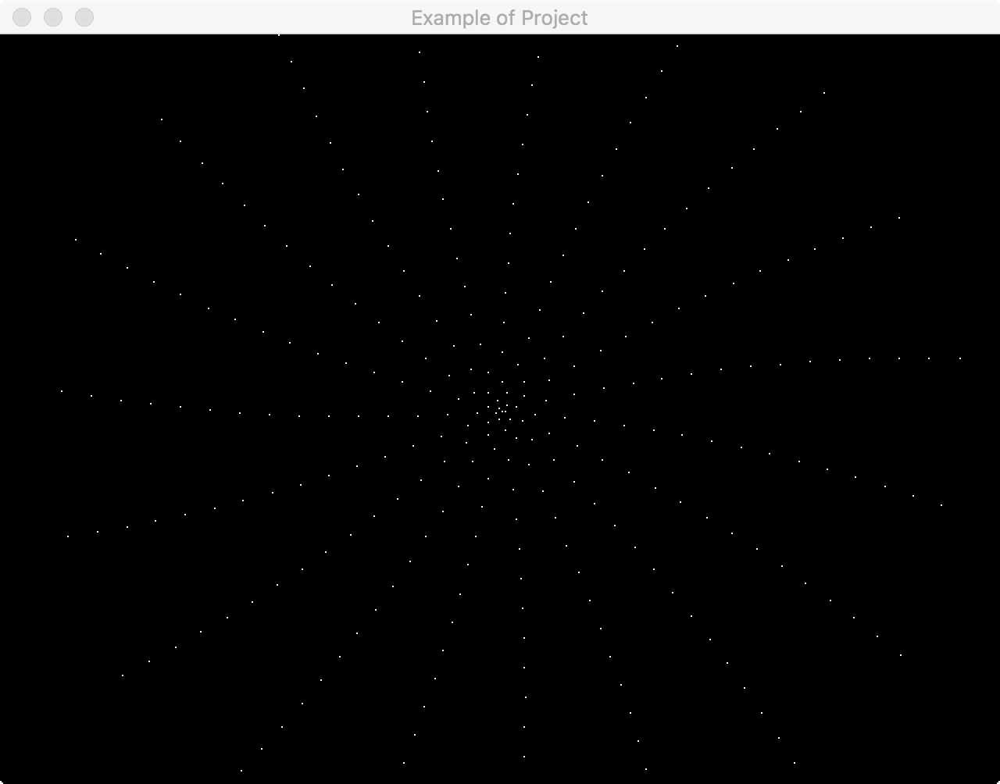

# A Basic app skeleton composed by SDL2, Lua 5.3 and CMake

**WIP - I'am working on documentation and some installation instructions**

You can use it as a starting point for small projects. My intention here is to have an easy starting point for small projects that need graphics, easily extension with Lua and a portable build system like CMake.

It is an essential app in SDL 2 with events, input management, and exposing some functions to Lua as an example.




## Required Tools
[Read here more instructions per platform](REQUIREMENTS.md).

## Features
- Cmake, see [Requirements](REQUIREMENTS.md)
- [SDL 2](INSTALL_SDL.md)
- [Lua 5.3](INSTALL_LUA.md)

## Building the Project
Start cloning this repository.

```sh
git clone https://github.com/klassmann/sdl2-lua53-example.git myproject
```

Inside the repository.

```
mkdir build
cd build
```

Select your plataform to follow the **cmake** instructions.

### Linux
The following command will prepare the project with a Makefile.
```sh
cmake ..
make
```

### MacOSX
You can use the previous configuration for **Linux** and use Makefiles or you can do the following commando for generating a Xcode project.
```sh
cmake -G"Xcode" ..
open example.xcodeproj # The default name is "example" in CMakeLists.txt
```

### Windows
TODO.

## License
[MIT](LICENSE).